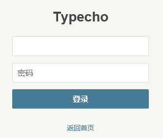
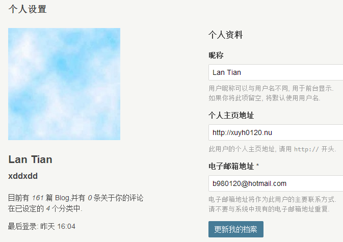

昨天下午回到家，打开feedly，看到[小蒋博客](http://www.zntec.cn/archives/typecho-0-9.html)上有篇Typecho 0.9的文章。

啥，Typecho居然在有生之年更新了！？果断打开[Typecho 官网](http://typecho.org)，居然看到了TE那个简洁的默认主题。我记得以前官网不是长这样。

发布文章上来就一句话“是的，你没有进错网址，目前这个简陋的地方确实是Typecho的官方网站”。。。

于是我马上下载、更新、安装。

更新方法很简单，登上FTP删掉admin、var目录和index.php，把0.9版本的这几个文件传上来，然后到后台更新数据库就行。

打开登录页面，我瞬间觉得高端大气上档次。

据说TE0.9增加了Markdown编辑器，要到个人面板开启。虽然不用，但是还是看一眼。个人面板也是高端大气上档次啊。

文章编辑界面。和WordPress有点相像。

HTML5的图片上传，终于告别Flash了。还支持拖放呢。

不管怎么说，一年之后，TE终于有了动静，接下来就是等TE完善了。
