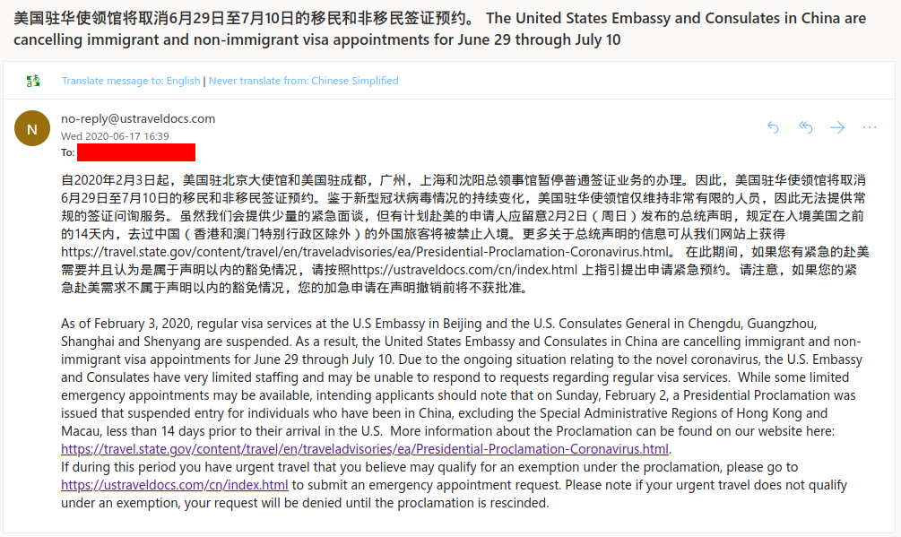
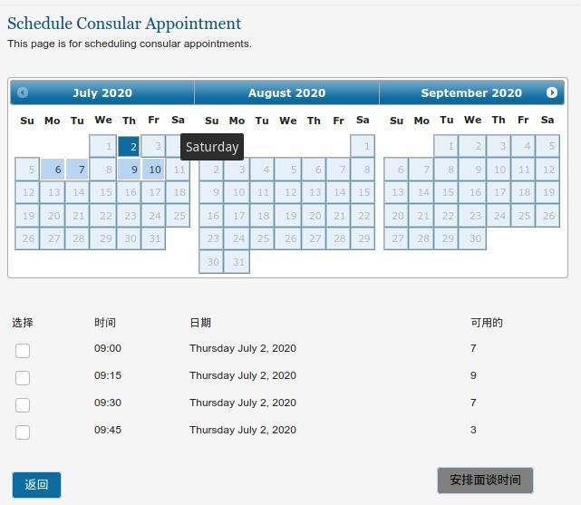

附取消邮件内容：

> 自2020年2月3日起，美国驻北京大使馆和美国驻成都，广州，上海和沈阳总领事馆暂停普通签证业务的办理。因此，美国驻华使领馆将取消6月29日至7月10日的移民和非移民签证预约。鉴于新型冠状病毒情况的持续变化，美国驻华使领馆仅维持非常有限的人员，因此无法提供常规的签证问询服务。虽然我们会提供少量的紧急面谈，但有计划赴美的申请人应留意2月2日（周日）发布的总统声明，规定在入境美国之前的14天内，去过中国（香港和澳门特别行政区除外）的外国旅客将被禁止入境。更多关于总统声明的信息可从我们网站上获得https://travel.state.gov/content/travel/en/traveladvisories/ea/Presidential-Proclamation-Coronavirus.html。 在此期间，如果您有紧急的赴美需要并且认为是属于声明以内的豁免情况，请按照https://ustraveldocs.com/cn/index.html 上指引提出申请紧急预约。请注意，如果您的紧急赴美需求不属于声明以内的豁免情况，您的加急申请在声明撤销前将不获批准。
>
> As of February 3, 2020, regular visa services at the U.S Embassy in Beijing and the U.S. Consulates General in Chengdu, Guangzhou, Shanghai and Shenyang are suspended. As a result, the United States Embassy and Consulates in China are cancelling immigrant and non-immigrant visa appointments for June 29 through July 10. Due to the ongoing situation relating to the novel coronavirus, the U.S. Embassy and Consulates have very limited staffing and may be unable to respond to requests regarding regular visa services.  While some limited emergency appointments may be available, intending applicants should note that on Sunday, February 2, a Presidential Proclamation was issued that suspended entry for individuals who have been in China, excluding the Special Administrative Regions of Hong Kong and Macau, less than 14 days prior to their arrival in the U.S.  More information about the Proclamation can be found on our website here: https://travel.state.gov/content/travel/en/traveladvisories/ea/Presidential-Proclamation-Coronavirus.html.
If during this period you have urgent travel that you believe may qualify for an exemption under the proclamation, please go to https://ustraveldocs.com/cn/index.html to submit an emergency appointment request. Please note if your urgent travel does not qualify under an exemption, your request will be denied until the proclamation is rescinded.