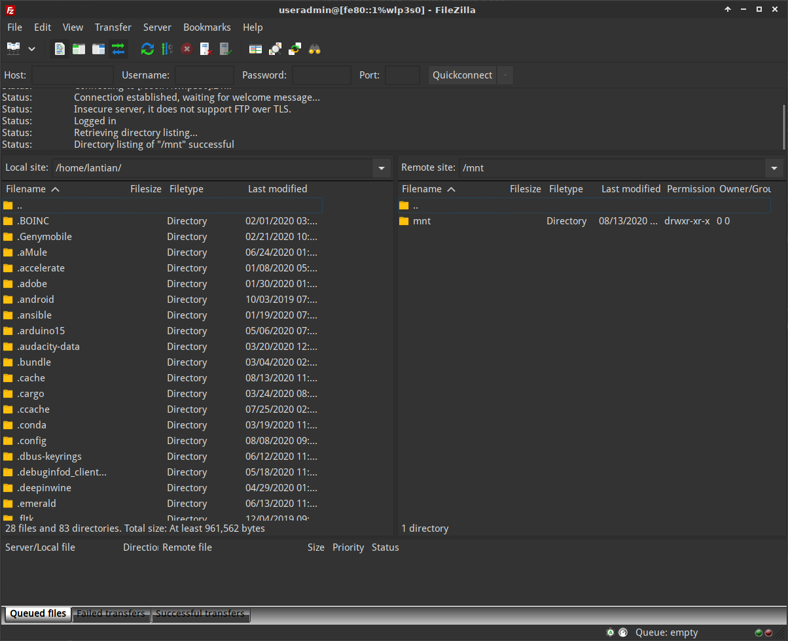

本文介绍如何在不拆光猫、不使用串口转换器的情况下，破解友华 PT926G 光猫的以下权
限：

-   管理面板的超级管理员用户（telecomadmin）
-   Telnet 的 root 用户
-   访问 FTP

坐标深圳电信。

## 登录超级管理员界面

如果你直接访问光猫的 IP（`http://192.168.1.1`），你会看到以下的智能网关登录界
面：


在这个界面你可以用 useradmin 账户和光猫背后标记的密码登录，但进去之后没什么功
能，只有一个 Wi-Fi 的设置是有用的。

但 nmap 扫描显示事情并不简单：

```bash
$ nmap -v 192.168.1.1
# 省略一些输出
PORT      STATE    SERVICE
21/tcp    filtered ftp
22/tcp    filtered ssh
23/tcp    filtered telnet
53/tcp    filtered domain
80/tcp    open     http
445/tcp   open     microsoft-ds
8080/tcp  open     http-proxy
10001/tcp open     scp-config
32768/tcp open     filenet-tms
```

有一个 8080 端口，我们访问一下（`http://192.168.1.1:8080`）：


嗯，熟悉的味道，用电信的万年默认密码试一下（`telecomadmin / nE7jA%5m`）：


居然就进去了，深圳电信不改默认密码。

> 如果你所在的地区电信改了这个默认密码，你有几个选项：
>
> -   记录光猫的 LOID 等信息后拔掉光纤，恢复出厂设置，使用默认密码登录关掉配置下
>     发后再输入 LOID 等联网；
> -   拆光猫并使用串口转换器。
>
> 以上操作需要你自行查找资料，本文不涉及。

## 开启 Telnet

根
据[宽带技术网 tm5880891 的这篇帖子](http://www.chinadsl.net/forum.php?mod=viewthread&tid=165272)，
按照如下步骤操作即可：

1. 首先在 `http://192.168.1.1:8080` 以 telecomadmin 登录；
    - 这一步可能不是必须的，就算你不知道 telecomadmin 密码也可以试一下下一步。
2. 访问 `http://192.168.1.1:8080/cgi-bin/abcdidfope94e0934jiewru8ew414.cgi`，页
   面应该会显示 `success`。
3. 然后你就可以 `telnet 192.168.1.1` 连接了。
    - 用户名是 `admin`
    - 密码是 `TeleCom_1234`

但这个 Telnet 连接后进入的是一个魔改的 Shell，只能执行非常有限的白名单内的命令：

-   ip
-   ifconfig
-   route
-   ping
    -   你可以用这些命令来调试网络。
-   su
    -   很重要的命令，但目前我们还不知道密码。

其它指令都不能用。但我发现这个 Shell 的 Tab 自动补全还能用，可以用它来列出文件目
录。例如：

```bash
# 输入 /，Telnet 命令行上显示如下内容
$/
# 按两下 Tab 键
.lstripped  etc/        lib/        overlay/    sys/        usr/
bin/        home/       mnt/        proc/       tmp/        var/
dev/        image/      opt/        sbin/       userfs/
# 列出了根目录的文件列表，以此类推可以列出其它文件夹的内容
```

一番查找后我发现 `http://192.168.1.1:8080` 这个页面存放在 `/home/httpd/web/`，并
在其中发现了许多奇怪的页面。

## 导出配置文件

目前互联网上的教程大都涉及连接光猫自带的 FTP 服务器，从中下载文件，但我这只光猫
系统已经更新，21 端口已经不通了（如先前 nmap 所示）。

但之前发现的一个奇怪的页面可以直接导出配置文件：

1. 首先在 `http://192.168.1.1:8080` 以 telecomadmin 登录；
    - 这里这一步是必须的，也就是你必须先知道 telecomadmin 的密码。
2. 然后访问 `http://192.168.1.1:8080/bd/saveconf.asp`，点击 `Backup` 按钮；
3. 你会获得一个 XML 文件，这就是光猫的配置文件。

## 获得 Telnet 管理员密码

打开配置 XML 文件，搜索 `MIB_TELNET_CLI_PASSWD`，找到对应的 value，类似
`TeleCom_1a2b3c`，这就是管理员密码。

在 Telnet 输入 su，然后这个密码，Shell 前面的提示就由 `$` 变成了 `#`。此时你已经
是 root 了，开始为所欲为吧！

## 访问光猫自带 FTP

由于之前通过 FTP 获取配置文件这个破解方法的存在，新版光猫固件屏蔽了 FTP 的 21 端
口。但是 FTP 服务本身还在运行，并且光猫的屏蔽做的不好，只屏蔽了 IPv4 的连接，没
有屏蔽 IPv6 的连接。

这就意味着你可以连接光猫 IPv6 地址的 FTP 端口，例如我们先拿 nmap 扫一下：

```bash
# 从 http://192.168.1.1:8080 查看光猫 IPv6 地址
# 注意这里不需要 telecomadmin，useradmin 也可以
$ nmap -v -6 240e:xxxx:xxxx::xxxx
# 这里替换成光猫的 IPv6 地址
# 省略一些输出
PORT     STATE    SERVICE
21/tcp   open     ftp
22/tcp   filtered ssh
23/tcp   open     telnet
53/tcp   filtered domain
80/tcp   open     http
445/tcp  open     microsoft-ds
8080/tcp open     http-proxy
```

然后拿起 FTP 工具连上去就可以了，用户名是 `useradmin`，密码在你的光猫背后：



> 这里我用的是光猫的 Link-local 地址（`fe80::1%wlp3s0`），其中 wlp3s0 是我 Linux
> 系统的网卡界面名称。Windows 下可能没有这种操作，此时用光猫的公网 IPv6 地址即
> 可。

但即使你连上了 FTP 也无法使用旧版的破解方法，这个 FTP 的访问范围已经被限制在了
`/mnt` 文件夹，无法访问 `/var/config` 里的配置文件。

## 参考资料

感谢前人付出的努力。

-   [友华 PT926E PT926G 技术部分公开（宽带技术网 tm5880891）](http://www.chinadsl.net/forum.php?mod=viewthread&tid=165272)
-   [友华 PT926E PT926G 改地区，改 MAC SN 的方法（宽带技术网 tm5880891）](http://www.chinadsl.net/forum.php?mod=viewthread&tid=166519)
